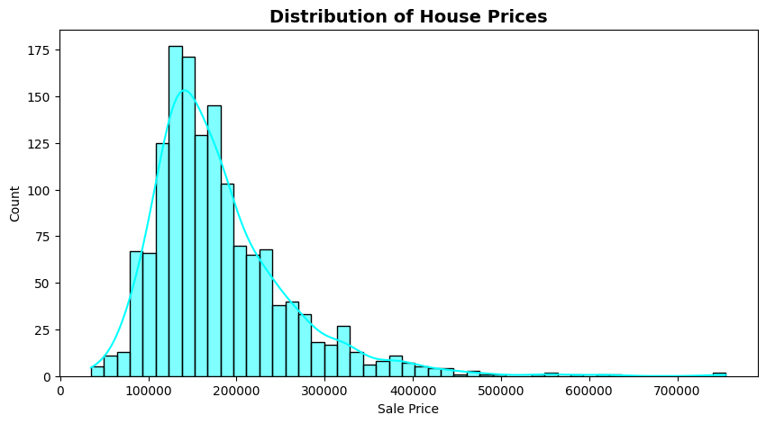
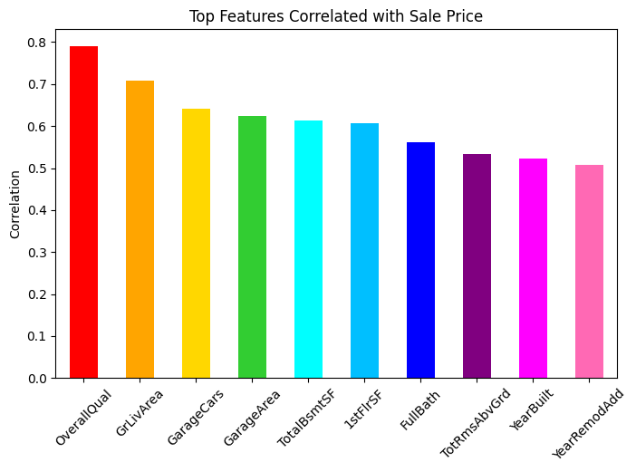
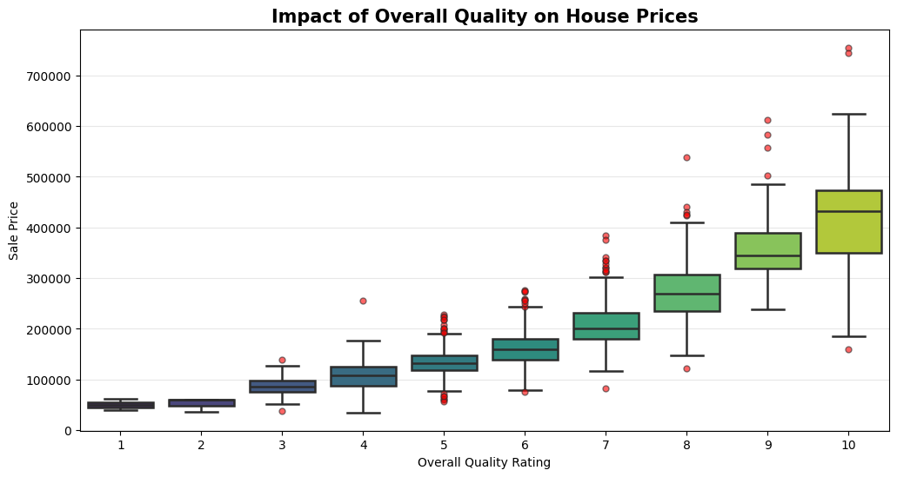
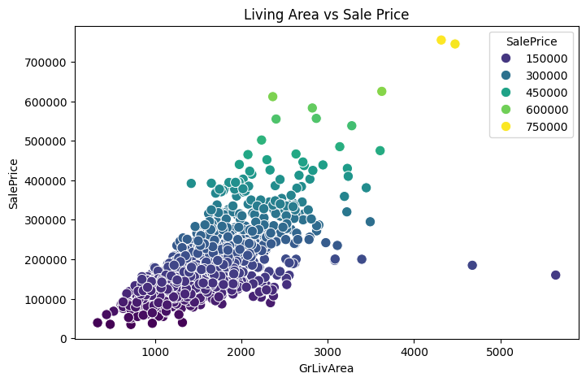
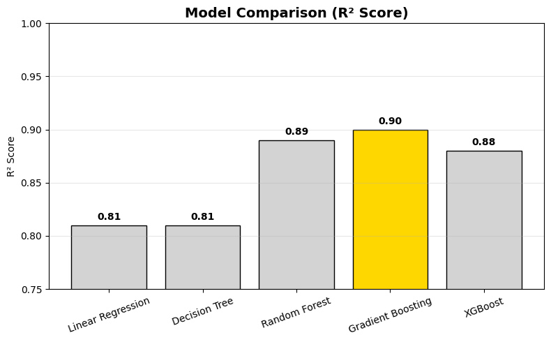
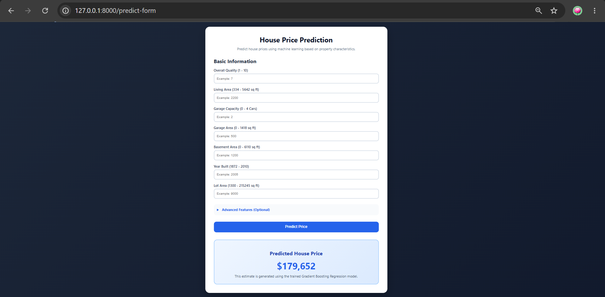
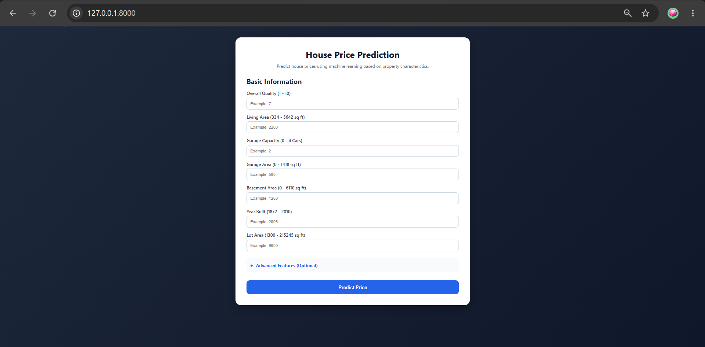

# 🏠 House Price Prediction

An end-to-end Machine Learning project that predicts residential house prices using property characteristics such as living area, overall quality, garage capacity, basement area, lot size, and construction year.

The project demonstrates a complete MLOps workflow including:

* Data Cleaning & Preprocessing
* Exploratory Data Analysis (EDA)
* Feature Engineering
* Model Training & Evaluation
* Experiment Tracking
* FastAPI Development
* Docker Containerization
* GitHub Actions CI/CD

---

# Project Overview

Estimating property prices accurately is important for buyers, sellers, and real-estate professionals.

This project uses the Ames Housing Dataset and Machine Learning techniques to predict house prices based on multiple property attributes.

The final solution includes:

* Trained Regression Model
* FastAPI REST API
* Interactive Prediction Interface
* Dockerized Deployment
* Automated CI Pipeline

---

# Dataset

### Dataset Used

Ames Housing Dataset

### Target Variable

```text
SalePrice
```

### Selected Features

| Feature      | Description                         |
| ------------ | ----------------------------------- |
| OverallQual  | Overall material and finish quality |
| GrLivArea    | Above ground living area (sq ft)    |
| GarageCars   | Garage capacity in number of cars   |
| GarageArea   | Garage area (sq ft)                 |
| TotalBsmtSF  | Total basement area (sq ft)         |
| 1stFlrSF     | First floor area (sq ft)            |
| FullBath     | Number of full bathrooms            |
| TotRmsAbvGrd | Total rooms above ground            |
| YearBuilt    | Original construction year          |
| YearRemodAdd | Remodeling year                     |
| MasVnrArea   | Masonry veneer area                 |
| Fireplaces   | Number of fireplaces                |
| LotArea      | Lot size (sq ft)                    |

---

# Exploratory Data Analysis

Several visualizations were performed to understand feature relationships and identify patterns affecting house prices.

---

## Distribution of House Prices

Understanding the distribution of the target variable helps identify skewness and potential outliers.



---

## Features Correlated with Sale Price

This visualization highlights the features most strongly associated with house prices.



---

## Impact of Overall Quality on House Prices

Overall quality is one of the strongest predictors of property value.



---

## Living Area vs Sale Price

A positive relationship exists between living area and house prices.



---

# Model Training

The following regression models were trained and evaluated.

| Model                       |
| --------------------------- |
| Linear Regression           |
| Decision Tree Regressor     |
| Random Forest Regressor     |
| Gradient Boosting Regressor |
| XGBoost Regressor           |

---

# Model Comparison

The models were compared using the R² Score metric.



---

# Final Model Selection

### Selected Model

Gradient Boosting Regressor

### Why Gradient Boosting?

* Highest prediction accuracy
* Strong generalization capability
* Robust performance on unseen data
* Consistent evaluation metrics

---

# Project Structure

```text
house-price-prediction/
│
├── .github/
│   └── workflows/
│       └── ci.yml
│
├── artifacts/
│   ├── model.pkl
│   ├── features.json
│   ├── metrics.json
│   ├── train.csv
│   ├── test.csv
│   └── raw.csv
│
├── notebooks/
│
├── Results/
│   ├── Distribution_of_house_price.png
│   ├── Features_correlated_with_sale_price.png
│   ├── Impact_overall_Quality_on_house_prices.png
│   ├── Living_Area_vs_Sale_Price.png
│   ├── Model_comparison.png
│   ├── Prediction.png
│   └── Swagger.png
│
├── src/
│   ├── components/
│   ├── prediction/
│   ├── logger.py
│   └── exception.py
│
├── static/
├── templates/
│
├── app.py
├── Dockerfile
├── requirements.txt
├── setup.py
└── README.md
```

---

# API Development

A FastAPI application was developed to serve predictions.

### Prediction Endpoint

```http
POST /predict
```

### Sample Request

```json
{
  "OverallQual": 7,
  "GrLivArea": 2200,
  "GarageCars": 2,
  "GarageArea": 500,
  "TotalBsmtSF": 1200,
  "1stFlrSF": 1200,
  "FullBath": 2,
  "TotRmsAbvGrd": 8,
  "YearBuilt": 2005,
  "YearRemodAdd": 2005,
  "MasVnrArea": 150,
  "Fireplaces": 1,
  "LotArea": 9000
}
```

### Sample Response

```json
{
  "predicted_price": 266804.80
}
```

---

# Application Screenshots

## House Price Prediction Interface

The web application allows users to enter property details and obtain real-time predictions.



---

## Swagger Documentation

FastAPI automatically generates interactive API documentation.

Access locally:

```text
http://localhost:8000/docs
```



---

# Running Locally

## Clone Repository

```bash
git clone https://github.com/YOUR_USERNAME/House-Price-Prediction.git
```

```bash
cd House-Price-Prediction
```

---

## Create Virtual Environment

```bash
python -m venv venv
```

### Windows

```bash
venv\Scripts\activate
```

### Linux / Mac

```bash
source venv/bin/activate
```

---

## Install Dependencies

```bash
pip install -r requirements.txt
```

---

## Run FastAPI

```bash
uvicorn app:app --reload
```

Open:

```text
http://localhost:8000
```

Swagger Docs:

```text
http://localhost:8000/docs
```

---

# Docker Support

## Build Docker Image

```bash
docker build -t house-price-app .
```

---

## Run Docker Container

```bash
docker run -d -p 8000:8000 --name house-price-container house-price-app
```

---

## Verify Container

```bash
docker ps
```

---

# Continuous Integration

GitHub Actions is configured to automatically:

* Install dependencies
* Validate project structure
* Build application
* Run CI checks
* Verify project integrity

Workflow File:

```text
.github/workflows/ci.yml
```

---

# Technologies Used

| Category            | Tools                 |
| ------------------- | --------------------- |
| Programming         | Python                |
| Data Processing     | Pandas, NumPy         |
| Visualization       | Matplotlib, Seaborn   |
| Machine Learning    | Scikit-Learn, XGBoost |
| API Framework       | FastAPI               |
| Containerization    | Docker                |
| CI/CD               | GitHub Actions        |
| Experiment Tracking | MLflow, DagsHub       |
| Version Control     | Git & GitHub          |

---

# Future Improvements

* React Frontend
* Cloud Deployment (AWS)
* Automated Model Retraining
* Model Monitoring
* Feature Importance Dashboard
* Advanced Hyperparameter Tuning

---

# Author

**Dimpal Panchal**